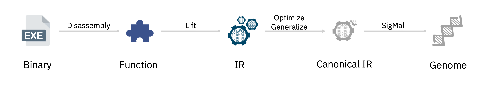
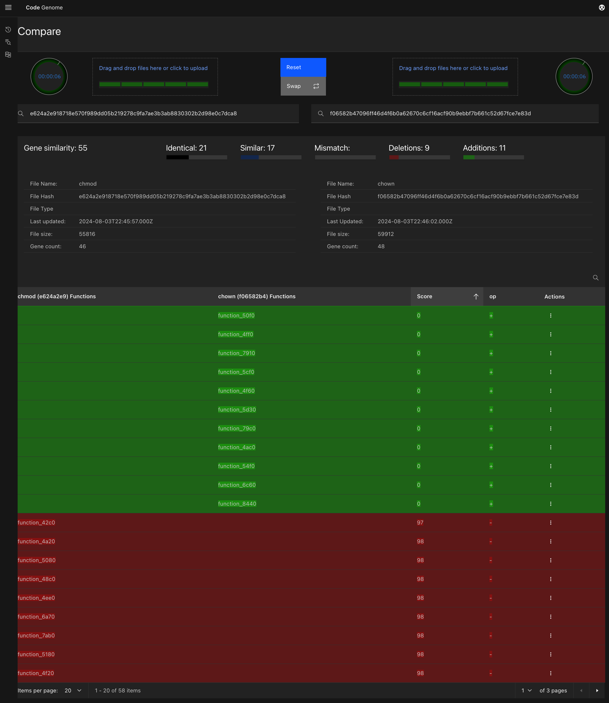

# Code Genome

Code Genome is a framework for extracting semantic code fingerprints or "genes" from executable binaries or source code.

Core functionalities of the framework are gene extraction from binaries, gene-level binary diffing (`genediff`), and gene search.



## Quick Start

To clone this repo, run

```
git clone https://github.com/code-genome/codegenome.git
cd codegenome
git submodule update --init --recursive
```

To start a docker based instance, run

```
make start
```

This will start a CodeGenome UI instance at http://localhost:5000



To stop the instance, run

```
make stop
```

Cache data for processed files are located by default at `~/.cg/cache` folder.

## Build and Installation

### Local docker build

To build a docker image locally, run

```
make docker-builds
make start_local
```

### Local build

A local build and installation will require [RetDec](https://github.com/avast/retdec) and [LLVM](https://github.com/llvm).

Build is currently supported only on Debian-based distributions (e.g. Ubuntu).

Create a virtual environment.

```
python -mvenv .venv
. .venv/bin/activate
```

Install dependencies.

```
make deps
```

Install `codegenome`.

```
pip install .
```

Run a CLI tool.

```
cg genediff /path/to/binary1 /path/to/binary2
```

## Contributing

Check out our [contributing](./CONTRIBUTING.md) guide to learn how to contribute.
